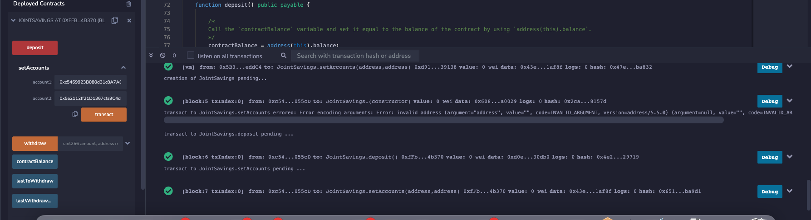
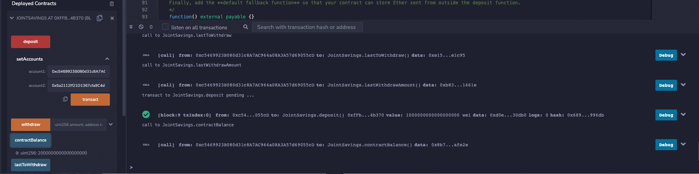
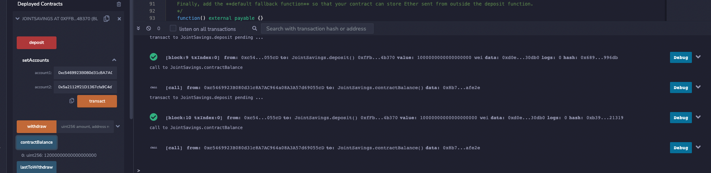
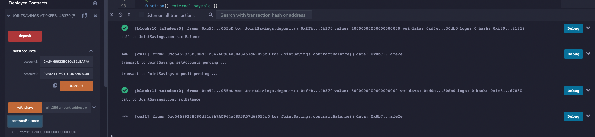
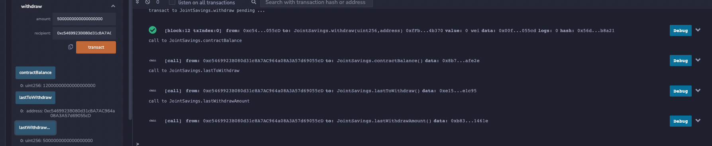
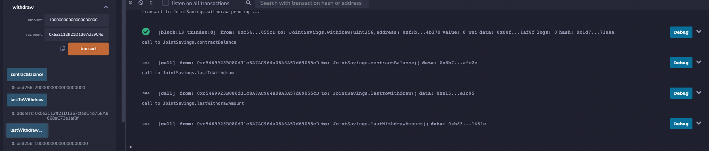

# challenge_20_joint_savings_contract
Week 20 challenge, creating a joint savings account with deposit, withdraw, and check balance functionality on the Ethereum blockchain

## Functionality

### deposit

Allows a user to deposit Eth into the joint savings account

### setAccount

Allows user to set which two wallet addresses can withdraw funds

### withdraw

Allows user to withdraw funds to one of two approved wallet addresses

### contractBalance

Shows current joint savings account balance

### lastToWithdraw

Shows which wallet address received last withdrawal

### lastWithdrawAmount

Shows amount of last withdrawal

## Using the smart contract

1. Pull joint_savings.sol from this repo and open using [Ethereum Remix IDE](https://remix.ethereum.org/)

2. Compile the smart contract

3. In the Remix IDE, navigate to the “Deploy & Run Transactions” pane, and then make sure that “JavaScript VM” is selected as the environment.

4. Click the Deploy button to deploy your smart contract, and then confirm that it successfully deployed by testing each function

### Used the setAccounts function to define the authorized Ethereum address that will be able to withdraw funds from your contract

### Tested the deposit functionality of the smart contract by sending the following amounts of ether.

#### Transaction 1: Send 1 ether as wei.

#### Transaction 2: Send 10 ether as wei.

#### Transaction 3: Send 5 ether.

### Tested the contract’s withdrawal functionality by withdrawing 5 ether into accountOne and 10 ether into accountTwo

## Contributors

This analysis was created by Nico Cortese with support from the lovely Fintech Coding Boot Camp Team at Boot Camp Spot / Columbia School of Engineering

Nico Cortese

XXX-XXX-XXXX

XXXX@gmail.com

---

## License

MIT License

Copyright (c) 2022 NicoCortese

Permission is hereby granted, free of charge, to any person obtaining a copy
of this software and associated documentation files (the "Software"), to deal
in the Software without restriction, including without limitation the rights
to use, copy, modify, merge, publish, distribute, sublicense, and/or sell
copies of the Software, and to permit persons to whom the Software is
furnished to do so, subject to the following conditions:

The above copyright notice and this permission notice shall be included in all
copies or substantial portions of the Software.

THE SOFTWARE IS PROVIDED "AS IS", WITHOUT WARRANTY OF ANY KIND, EXPRESS OR
IMPLIED, INCLUDING BUT NOT LIMITED TO THE WARRANTIES OF MERCHANTABILITY,
FITNESS FOR A PARTICULAR PURPOSE AND NONINFRINGEMENT. IN NO EVENT SHALL THE
AUTHORS OR COPYRIGHT HOLDERS BE LIABLE FOR ANY CLAIM, DAMAGES OR OTHER
LIABILITY, WHETHER IN AN ACTION OF CONTRACT, TORT OR OTHERWISE, ARISING FROM,
OUT OF OR IN CONNECTION WITH THE SOFTWARE OR THE USE OR OTHER DEALINGS IN THE
SOFTWARE.